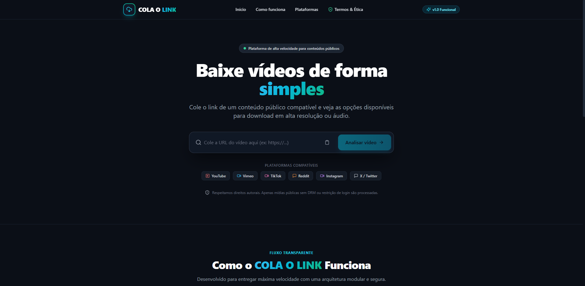

# 🎬 COLA O LINK

<p align="center">
  
</p>

<p align="center">
  <strong>Cole o link. Baixe sem estresse.</strong><br>
  <em>Plataforma brasileira de alta performance para processamento, conversão e download de mídias públicas com modelo de monetização integrado.</em>
</p>

<p align="center">
  
  
  
  
  
  
</p>

---

## 📌 Visão Geral do Projeto

O **COLA O LINK** é uma aplicação web full-stack moderna, veloz e escalável criada para resolver a dor de milhões de usuários brasileiros que buscam baixar vídeos e músicas da internet sem serem bombardeados por vírus, pop-ups invasivos ou páginas confusas.

Além da excelência técnica e visual, o projeto foi projetado estrategicamente com uma **arquitetura orientada a monetização (SaaS / Freemium)** e com **custo operacional próximo a zero** (graças ao modelo efêmero de retenção zero de arquivos).

---

## 💎 Modelo de Negócio & Monetização

O **COLA O LINK** foi estruturado para gerar múltiplas fontes de receita previsíveis e passivas:

```text
                               ┌─────────────────────────────┐
                               │       COLA O LINK           │
                               │  (Estratégia de Receita)    │
                               └──────────────┬──────────────┘
                                              │
         ┌───────────────────┬────────────────┼───────────────────┬───────────────────┐
         ▼                   ▼                ▼                   ▼                   ▼
┌─────────────────┐ ┌─────────────────┐ ┌────────────────┐ ┌─────────────────┐ ┌─────────────────┐
│ Assinatura VIP  │ │ Anúncios Limpos │ │ Ferramentas IA │ │ Afiliados       │ │ API B2B         │
│ R$ 9,90 / mês   │ │ Banners nativos │ │ Transcrição e  │ │ Softwares de    │ │ Créditos para   │
│ Sem fila / 4K   │ │ durante loading │ │ cortes Shorts  │ │ edição de vídeo │ │ devs e bots     │
└─────────────────┘ └─────────────────┘ └────────────────┘ └─────────────────┘ └─────────────────┘
```

### 1. 👑 Plano VIP / PRO (Assinatura Recorrente via Pix e Stripe)
- **Usuário Grátis:** Downloads individuais em até 1080p com velocidade padrão.
- **Usuário VIP (R$ 9,90/mês ou R$ 29/ano):**
  - **Fila prioritária instantânea** (processamento acelerado).
  - **Download de Playlists inteiras** com 1 clique em arquivo `.zip`.
  - **Áudio de Alta Fidelidade (MP3 320 kbps / FLAC)**.
  - **Zero anúncios** em toda a interface.

### 2. 📢 Publicidade Programática Nativa
- Posicionamento estratégico de banners não-intrusivos (Google AdSense / Monetag / Adsterra).
- Anúncio de espera contextual exibido enquanto a barra de progresso do FFmpeg finaliza o vídeo.

### 3. ✂️ Recursos Premium para Criadores de Conteúdo
- **Gerador de Cortes:** Extração de trechos específicos de vídeos longos prontos para TikTok / Reels / Shorts.
- **Transcrição com IA:** Geração automática de legendas `.srt` e texto transcrito.

### 4. 🤝 Marketing de Afiliados
- Recomendações integradas de editores de vídeo (CapCut Pro, Canva, Filmora) e bancos de áudio.

---

## ⚡ Diferenciais Técnicos

- 🎧 **Áudio e Vídeo 100% Sincronizados:** Integração com **FFmpeg** para mesclagem automática de trilhas de vídeo HD e áudio em formato puro `.mp4`.
- 🎵 **Conversão Real para MP3:** Extração de faixas sonoras convertidas diretamente em `.mp3` a 320 kbps.
- 🚀 **Fila Híbrida Inteligente:** Alterna automaticamente entre Fila em Memória (desenvolvimento local sem configurações) e Redis + BullMQ (produção de alta concorrência).
- 🧹 **Custo Zero de Armazenamento:** Política de Retenção Zero (TTL de 15 minutos). Arquivos temporários são apagados automaticamente por workers contínuos.

---

## 🛡️ Segurança, Criptografia e Conformidade

A plataforma segue rigorosos padrões de segurança cibernética e privacidade (LGPD/GDPR):

1. **Criptografia HMAC-SHA256:** Links de download geram tokens assinados criptograficamente com expiração temporal para impedir ataques de enumeração (IDOR) e vazamento de links.
2. **Proteção Anti-SSRF em Nível de DNS:** Validação rigorosa que impede requisições para IPs internos da infraestrutura (`localhost`, `10.x`, `192.168.x`, `169.254.169.254`).
3. **Zero Command Injection:** Subprocessos executados exclusivamente através de listas explícitas de argumentos com `shell: false`.
4. **Cabeçalhos HTTP Blindados:** Configuração nativa de HSTS, `X-Frame-Options: DENY` (anti-clickjacking), `nosniff` e `Permissions-Policy`.
5. **Conformidade Ética:** O sistema não contorna DRM (Widevine/FairPlay), não acessa conteúdo privado sem autorização e não quebra paywalls.

---

## 🧰 Stack Tecnológica

| Camada | Tecnologias |
| :--- | :--- |
| **Frontend** | Next.js 14 (App Router), React 18, TypeScript, Tailwind CSS, Lucide Icons |
| **Backend** | Next.js Server Components & Route Handlers, Zod, Crypto API |
| **Mídia & Transcoding** | FFmpeg (Master Build) + yt-dlp |
| **Filas & Workers** | BullMQ + Redis / Fila em Memória Assíncrona |
| **Infraestrutura** | Docker (Multi-stage build), Docker Compose, Standalone Output |
| **Testes** | Vitest (Suíte automatizada com 14+ testes de segurança e providers) |

---

## 🏗️ Estrutura do Projeto

```text
COLA O LINK
├── app/
│   ├── api/
│   │   ├── analyze/                  # POST: Análise de metadados e formatos
│   │   └── download/                 # POST: Criação de jobs de download
│   │       └── [jobId]/
│   │           ├── route.ts          # GET: Status e progresso da fila
│   │           └── file/route.ts     # GET: Entrega segura de streaming do arquivo
│   ├── error.tsx                     # Error boundary do App Router
│   ├── global-error.tsx              # Fallback global
│   ├── globals.css                   # Estilos globais e design system escuro
│   ├── layout.tsx                    # Layout raiz com SEO e tags sociais
│   ├── loading.tsx                   # Indicador de carregamento suave
│   ├── not-found.tsx                 # Página 404 personalizada
│   └── page.tsx                      # Interface principal do usuário
├── components/                       # Componentes modulares
│   ├── DownloadProgress.tsx          # Card de progresso e botão de download final
│   ├── Footer.tsx                    # Rodapé com branding e links legais
│   ├── Header.tsx                    # Logotipo e navegação
│   ├── Hero.tsx                      # Campo de busca e colar link
│   ├── HowItWorks.tsx                # Guia visual em 3 passos
│   ├── PlatformStatus.tsx            # Status de compatibilidade das plataformas
│   ├── TermsModal.tsx                # Modal de termos de uso e conformidade
│   └── VideoCard.tsx                 # Seleção de resolução (1080p, 720p, MP3)
├── lib/
│   ├── errors/                       # Classes de erro tipadas
│   ├── process/                      # Subprocessos seguros isolados
│   └── security/                     # Rate limit, SSRF check, HMAC token e sanitize
├── providers/                        # Providers desacoplados
│   ├── instagram/                    # Provider Instagram (com suporte a cookies.txt)
│   ├── reddit/                       # Provider Reddit
│   ├── tiktok/                       # Provider TikTok
│   ├── vimeo/                        # Provider Vimeo
│   ├── x/                            # Provider X / Twitter
│   ├── youtube/                      # Provider YouTube
│   ├── registry.ts                   # Registro dinâmico de plataformas
│   └── ytdlp-runner.ts               # Runner do yt-dlp + FFmpeg
├── queues/                           # Abstração de filas (Memory & BullMQ)
├── services/                         # Serviços de negócio (Analyze, Download, Storage)
├── tests/                            # Testes unitários com Vitest
└── workers/                          # DownloadWorker e CleanupWorker
```

---

## 🚀 Como Executar Localmente

### 1. Pré-requisitos
- **Node.js**: v18+ ou v20+
- **NPM** instalado

### 2. Instalação e Execução

```bash
# 1. Instalar as dependências
npm install

# 2. Executar a suíte de testes de segurança
npm test

# 3. Iniciar o servidor de desenvolvimento
npm run dev
```

Abra **[http://localhost:3000](http://localhost:3000)** no seu navegador.

---

## 🐳 Executando com Docker (Produção)

Para subir o ambiente completo com **Node.js + Redis + FFmpeg + yt-dlp** isolados:

```bash
# Iniciar todos os serviços
docker compose up -d --build

# Ver logs da aplicação
docker compose logs -f app

# Encerrar
docker compose down
```

---

## 🌐 Guia de Hospedagem Econômica

Para manter o custo fixo abaixo de **R$ 35,00/mês**:

1. **VPS Recomendada:** Hostinger Brasil (Datacenter São Paulo), Hetzner Cloud ou DigitalOcean.
2. **CDN & Proteção:** Cloudflare (Plano 100% Free com SSL e Anti-DDoS).
3. **Deploy:** Basta clonar o repositório na VPS e rodar `docker compose up -d`.

---

## ⚖️ Termos de Uso e Aviso Legal

O **COLA O LINK** é uma ferramenta utilitária para conversão e visualização de conteúdos públicos. O usuário é o único responsável pelo uso legal dos arquivos baixados, devendo respeitar os direitos autorais dos criadores de conteúdo e os termos de serviço de cada plataforma.

---

<p align="center">
  Feito com foco em performance, design e segurança.<br>
  <strong>COLA O LINK © 2026</strong>
</p>
